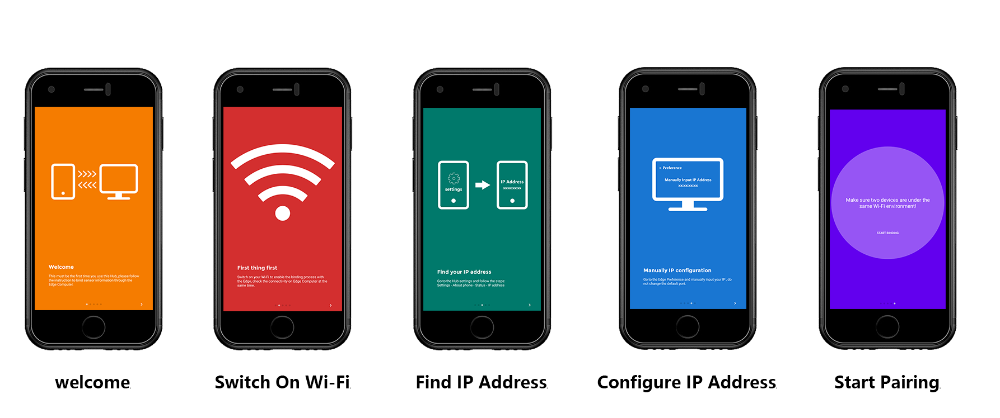
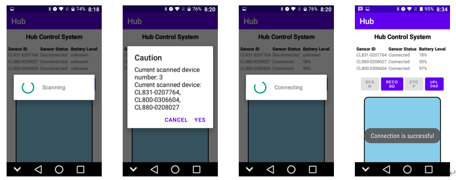
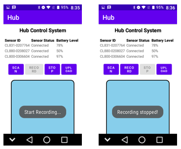
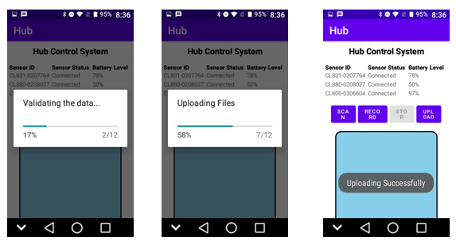
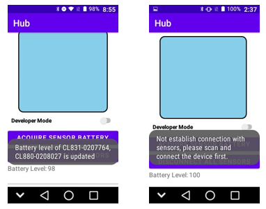

# Hub Controlling System

This is the source code for implementing the Hub for controlling three sensors. The software is designed for COMP2043 _Software Engineering Group Project_. 

### Installation

---

There are two ways to install the software

1. Compile from the source
2. Install through Android Application Package (APK)

#### Compile from source

In case you want to compile the whole program from source, you need to have the pre-requisite:

1. Android Studio
2. Android SDK (target SDK API level: 30, minimum SDK API level: 21)
3. Java SDK
4. Android Virtual Device (optional, if you don't have a physical Android device)
5. Gradle plugin

__Source code path: Hub/app/src/main/java/com/example/hub__

After that, you can use Gradle to sync the project, to download the packages you need for this project.


After the sync of Gradle is finished, you can run the app by pressing _run app_


##### Possible Debugging

1. `Failed to resolve: com.stephentuso:welcome:1.4.1 `: This is because jcenter is not included in the gradle configuration file: _settings.gradle_, please add `jcenter()`as shown in the following:

   ```
   dependencyResolutionManagement {
       repositoriesMode.set(RepositoriesMode.FAIL_ON_PROJECT_REPOS)
       repositories {
           google()
           mavenCentral()
           maven { url 'https://jitpack.io' }
           jcenter() // Warning: this repository is going to shut down soon
       }
   }
   ```

   Because this module: com.stephentuso:welcome:1.4.1 is not included in mavenCentral, it can only be obtained in jcenter.

2. `gradle sync failed`: Please turn on School's VPN

3. `Could not find method compile() for arguments`: use `implementation` for `build.gradle`

4. `A problem was found with the configuration of task ':app:packageDebug' (type 'PackageApplication').   - Type 'com.android.build.gradle.tasks.PackageApplication' property 'appMetadata' specifies file 'C:\Users\DELL\AndroidStudioProjects\Hub\app\build\intermediates\app_metadata\debug\app-metadata.properties' which doesn't exist.`: please delete folder `build` and rebuild the whole project.

#### Install through APK

Simply drag the APK into the local storage of the device, then installation will automatically start.


## Usage

#### First-time pairing

If it is the first time for user to use the Hub system, the welcome page will be popped out



to help you and guide you through binding with the Edge Computer (Edge Computer is another software developed by our project, please refer to Edge Computer Software)

Another choice is that you know for development purposes, you can simply add the sensor ID into  a file named `sensors.txt` and add it into the local root storage (usually `/storage/emulated/0/sensors.txt`).

Tip: Make sure you know exactly what sensors you are going to connect and the sensor ID. There is no way to enter the system unless `sensors.txt` are valid and not empty.

The format of the `sensors.txt` must be simply as follows:

```
CL800-0306604,CL831-0207764,CL880-0208027
```

where CLXXX is the general model ID of the product, CL800 refers to CHILEAF chest strap, CHILEAF CL831 refers to arm band, CHILEAF CL880 refers to smart bracelet, and the number behind it is the specific model ID for the product, each product has a different ID, it makes them different from other sensors, even though they are the same type of device.


#### Scan & Connect to device

##### Bluetooth Module

Bluetooth module use a third-party encapsulated library called _FastBle_ by Jasonchenlijian

_FastBle_ is an Android Bluetooth Low Energy package for:

- Filtering, scanning, linking, reading, writing, notification subscription and cancellation in a simple way.
- Supports acquiring signal strength and setting the maximum transmission unit.
- Support custom scan rules
- Support multi device connections
- Support reconnection
- Support configuration timeout for connect or operation

For more information about library-related configuration, please go to the website:  https://github.com/Jasonchenlijian/FastBle


The first step before recording the heart rate raw data from sensors is to scan and connect to device. The ID of sensor is included in `sensors.txt`. 



By pressing the scan button can you start scanning for ten seconds by default, this can be changed by changing the scan configuration at method: `private void setScanRule()` at `MainActivity.java`:

```java
private void setScanRule() {
        // sensor name list should be full
        // assert sensorNames != null;
        BleScanRuleConfig scanRuleConfig = new BleScanRuleConfig.Builder()
                .setDeviceName(true, sensorNames)			// only scan for designated device names send out by the edge
                .setScanTimeOut(10000)						// scan upmost time, by default 10 seconds
                .build();
        BleManager.getInstance().initScanRule(scanRuleConfig);
    }
```


#### Start Recording & Stop Recording

To start recording and stop recording, please make sure that sensors are connected, otherwise there is no way to notify the sensor to record.

Notify is achieved by a pre-developed method developed in _FastBle_:

```java
BleManager.getInstance().notify(
                bleDevice,
                uuid_service,
                uuid_characteristic_notify,
                new BleNotifyCallback() {

                    @Override
                    public void onNotifySuccess() {
                        // callback if notify is successful
                    }

                    @Override
                    public void onNotifyFailure(BleException exception) {
                       	// callback if notify is failed
                    }

                    @Override
                    public void onCharacteristicChanged(byte[] data) {
                        // callback if the data is received
                    }
                });
```

in this way, uuid must be known in advance for us to get the data from the sensors. All necessary information are in `Constant.java`

```java
public class Constant {
    // heart rate subscribe section
    public static final String HEART_RATE_SERVICE_UUID = "0000180d-0000-1000-8000-00805f9b34fb";
    public static final String HEART_RATE_CHARACTERISTIC_UUID = "00002a37-0000-1000-8000-00805f9b34fb";

    // ppg subscribe section
    public static final String PPG_SERVICE_UUID = "aae28f00-71b5-42a1-8c3c-f9cf6ac969d0";
    public static final String PPG_CHARACTERISTIC_UUID = "aae21542-71b5-42a1-8c3c-f9cf6ac969d0";

    // aac subscribe section
    public static final String ACC_SERVICE_UUID = "aae28f00-71b5-42a1-8c3c-f9cf6ac969d0";
    public static final String ACC_CHARACTERISTIC_UUID = "aae28f01-71b5-42a1-8c3c-f9cf6ac969d0";
}
```

User interface is presented as below:



By pressing the `RECORD`, the record start, by pressing `STOP`, the record stop, and the data are stored in the local database `device.db` at local root storage.

#### Validate & Upload

Validate process is achieved by checking the data received is continuous, or within the normal range.

After user press the `UPLOAD`, validation is the first thing to do, progress bar will also reveal that. Validation process is to produce file for transmission, and label incorrect data.

After validation, the file containing raw data will be stored at `/storage/emulated/0/Hub_Data/`

By default, after validation, the raw data will be automatically upload to designated place. In our project, a virtual machine served as the file server was used, the virtual machine is used on the Edge Computer, virtual machine has a static ip address that might be changed. 



If, for future development, ip address and port are changed, simply configuring the constants inside `SFTPConstant.java`

#### Acquire Sensor Battery

Different sensors have different battery level, in order to detect whether the battery are sufficient at the time when sensors are connected. 



User press `ACQUIRE SENSOR BATTERY` will acquire all the sensors battery via Bluetooth Read

Read is another method inside _FastBle_ library:

```java
BleManager.getInstance().read(
                bleDevice,
                uuid_service,
                uuid_characteristic_read,
                new BleReadCallback() {
                    @Override
                    public void onReadSuccess(byte[] data) {
                        // callback when read is success
                    }

                    @Override
                    public void onReadFailure(BleException exception) {
                        // callback when read is failed
                    }
                });
```

 Similarly, uuid of battery level must also be known in advance for us to get the data from the sensors. All necessary information are in `Constant.java`

```java
public class Constant {
	// three sensors battery service section
    public static final String BATTERY_SERVICE_UUID = "0000180f-0000-1000-8000-00805f9b34fb";
    public static final String BATTERY_CHARACTERISTIC_UUID = "00002a19-0000-1000-8000-00805f9b34fb";
}
```

Tip: sensor battery is also checked once the connection is established and after that the battery will be checked every 5 minutes.


## Acknowledgement

Here we acknowledge the third-party plugin or libraries we have used for this project:

FastBle:  https://github.com/Jasonchenlijian/FastBle (Bluetooth Module)

JSch: http://www.jcraft.com/jsch/ (Uploading data to server)

welcome-android: https://github.com/stephentuso/welcome-android (welcome page template)

InnerScrollView: https://gitee.com/kavin_tian/InnerScrollView (for scrolling a view inside a view)
